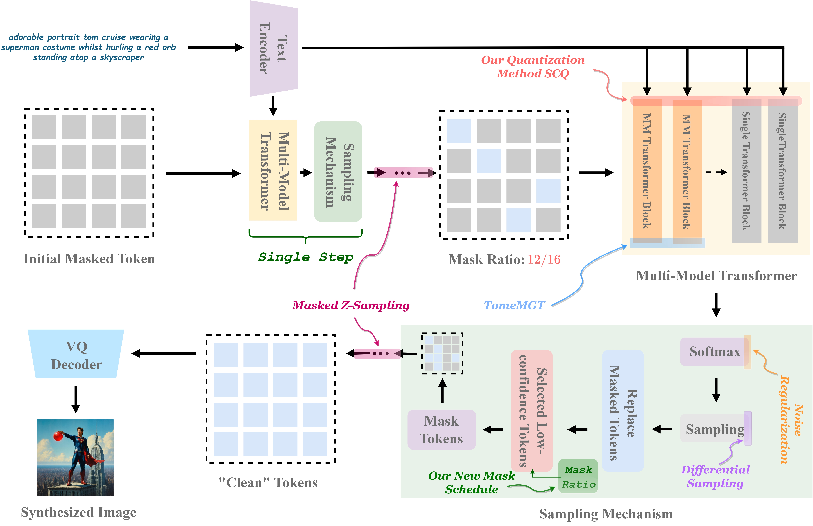

# Meissonic-Inference Pipeline Usage Guide😄 

## Offical Implementation of our research:

> [Bag of Design Choices for Inference of High-Resolution Masked Generative Transformer](https://arxiv.org/abs/2411.10781)

Authors:

> <em> Shaoshitong, Zikai Zhou, Tian Ye, Lichen Bai, Zhiqiang Xu and Zeke Xie* </em> <br>
> HKUST (Guangzhou) and MBZUAI <br>
> *: Corresponding author



## Overview

This guide provides instructions on how to use the inference-enhanced methods proposed by us, including ***noise regularization, differential sampling, zigzag sampling, token merging and model quantization***.


Here we provide the inference code which supports ***Meissonic 1024x1024, Meissonic 512x512.***

## Installation🚀️

Make sure you have successfully create the running environment of Meissonic, if not please follow instructions below:


### Create virtual environment
```bash
conda create --name meissonic python
conda activate meissonic
pip install -r requirements.txt
```

### Install diffusers
```bash
cd diffusers
pip install -e .
```

## Usage👀️ 

To use the inference pipeline, you need to run the `demo.py` script with appropriate command-line arguments. Below are the available options:

### Command-Line Arguments

- `--prompt`: The textual prompt based on which the image will be generated. Default is "Groot depicted as a flower."
- `--inference-step`: Number of inference steps for the diffusion process. Default is 50.
- `--cfg`: Classifier-free guidance scale. Default is 9.0.
- `--inversion-cfg`: Classifier-free guidance during inversion. Default is 0.0.
- `--size`: The size (height and width) of the generated image. Default is 1024.
- `--add-noise`: Enable the noise regularization or not. Default is "none".
- `--low-entropy`: Enable the differential sampling or not. Default is False.
- `--entropy-interval`: Control the number of tokens when using differential sampling.
- `--method`: Enable zigzag sampling or not. Default is "origin".
- `--token-merging`: Enable token merging or not. Default is False.


### Running the Script

Run the script from the command line by navigating to the directory containing `demo.py` and executing:


#### Standard Inference

```
CUDA_VISIBLE_DEVICES=0 python demo.py --prompt="Groot depicted as a flower" --add-noise=none --method=origin
```

#### with Noise Regularization
```
CUDA_VISIBLE_DEVICES=0 python demo.py --prompt="Groot depicted as a flower" --add-noise=cos --method=origin
```

#### with Differential Sampling

```
CUDA_VISIBLE_DEVICES=0 python demo.py --prompt="Groot depicted as a flower" --add-noise=none --low-entropy=True --method=origin
```

#### with Zigzag Sampling

```
CUDA_VISIBLE_DEVICES=0 python demo.py --prompt="Groot depicted as a flower" --add-noise=none --method=zigzag
```

#### with Token Merging

```
CUDA_VISIBLE_DEVICES=0 python demo.py --prompt="Groot depicted as a flower" --token-merging
```

#### with Zigzag Sampling and Noise Regularization

```
CUDA_VISIBLE_DEVICES=0 python demo.py --prompt="Groot depicted as a flower" --add-noise=cos --method=zigzag
```

#### with Zigzag Sampling and Differential Sampling

```
CUDA_VISIBLE_DEVICES=0 python demo.py --prompt="Groot depicted as a flower" --add-noise=none --low-entropy=True --method=zigzag
```


### Output🎉️ 

The script will save one images.


## Model Quantization (SCQ)🔥️

You can find the model quantization code in the `quantization` folder.

## ChallengeBench🤖️

You can find the ChallengeBench in the `challengebench` folder.

Acknowledgements

We would like to thank the authors of the original Meissonic, diffusers, tomesd and optimum-quanto repository for providing the code and resources.

## Citation

If you find our code useful for your research, please cite our paper.

```
@misc{meissonicinference,
      title={Bag of Design Choices for Inference of High-Resolution Masked Generative Transformer}, 
      author={Shitong Shao and Zikai Zhou and Tian Ye and Lichen Bai and Zhiqiang Xu and Zeke Xie},
      year={2024},
      eprint={2411.10781},
      archivePrefix={arXiv},
      primaryClass={cs.CV},
      url={https://arxiv.org/abs/2411.10781}, 
}
```

